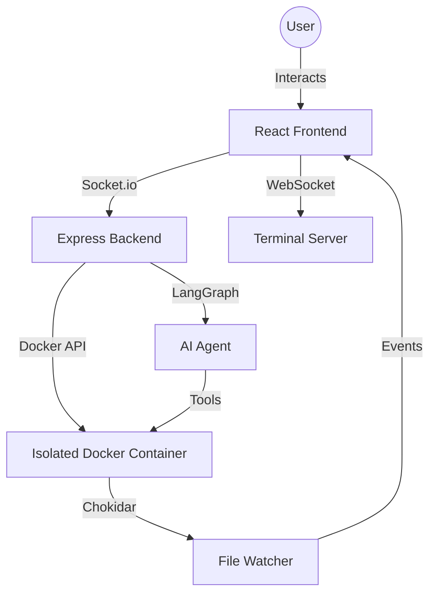

# CogniBox: Agentic AI Code Sandbox 🚀

CogniBox is an autonomous, browser-based development environment where an AI agent works alongside you. It isn't just an IDE; it's a **collaborative engineering system** designed for the Veersa Hackathon 2027.

## 🧠 Agentic AI Architecture (Mandatory Theme)
At the core of CogniBox is a **ReAct Agent** powered by **LangGraph** and **Groq**. 
- **Reasoning**: The agent doesn't just predict text; it observes the sandbox state, plans its next move, and reasons through complex coding tasks.
- **Autonomous Execution**: The agent has access to a real file system and a live terminal via a set of custom tools:
  - `listFiles`: Explore project structure.
  - `readFile` / `writeFile`: Direct code manipulation.
  - `runCommand`: Execute shell commands (npm, git, etc.) inside the sandbox.
- **Inspectable Prompts**: The agent's logic is defined in `backend/src/config/agent_prompts.json`, allowing reviewers to inspect and tune its behavior.

## 🏗️ System Design
CogniBox is built with a high-performance, modular architecture:
1. **Frontend (React 19 + Zustand)**: A premium, dark-mode UI with Monaco Editor and XTerm.js.
2. **Backend (Express + Node.js)**: Orchestrates project lifecycles and manages AI agent workflows.
3. **Infrastructure (Docker)**: Every sandbox runs in a fully isolated Docker container, ensuring security and consistency.
4. **Real-time Sync (Socket.io)**: Streams file changes, terminal output, and agent logs instantly to the browser.

### Architecture Diagram


## 🛠️ Tech Stack
- **Frontend**: React 19, Vite, Zustand, TanStack Query, Monaco Editor, XTerm.js, Ant Design.
- **Backend**: Node.js, Express, Socket.io, Dockerode, Chokidar.
- **AI**: LangGraph, LangChain, Groq (qwen-32b).

## 🚀 Getting Started

### Prerequisites
- Docker installed and running.
- Node.js 18+.

### Setup
1. **Clone the repo**
2. **Backend Configuration**:
   Create `backend/.env`:
   ```env
   PORT=3000
   GROQ_API_KEY=your_groq_key
   SANDBOX_IMAGE=sandbox
   ```
3. **Frontend Configuration**:
   Create `frontend/.env`:
   ```env
   VITE_BACKEND_URL=http://localhost:3000
   VITE_TERMINAL_URL=localhost:4000
   ```
4. **Install & Run**:
   - `cd backend && npm install && npm run dev`
   - `cd frontend && npm install && npm run dev`

## 🧪 Testing & Reliability
CogniBox follows engineering best practices:
- **Unit Testing**: Sandbox tools are validated for safety and correctness.
- **Manual Verification**: End-to-end flows are tested via live playground sessions.

## 🔐 Security
- **Isolation**: All code execution is confined to Docker containers.
- **Environment Safety**: Secrets are managed via `.env` files; no hardcoded keys.
- **Path Validation**: Agent tools include protection against path traversal.