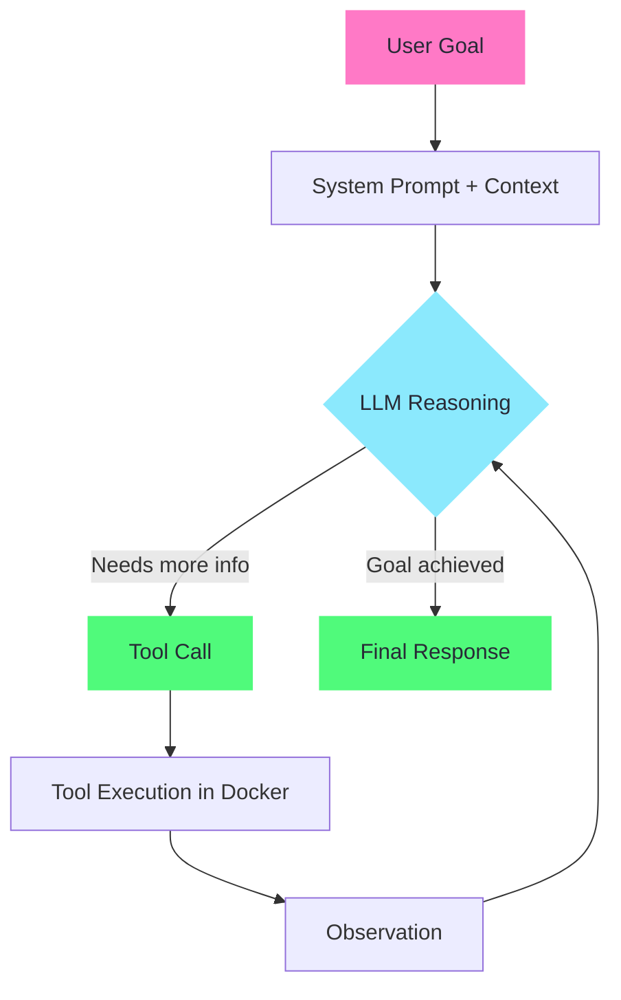
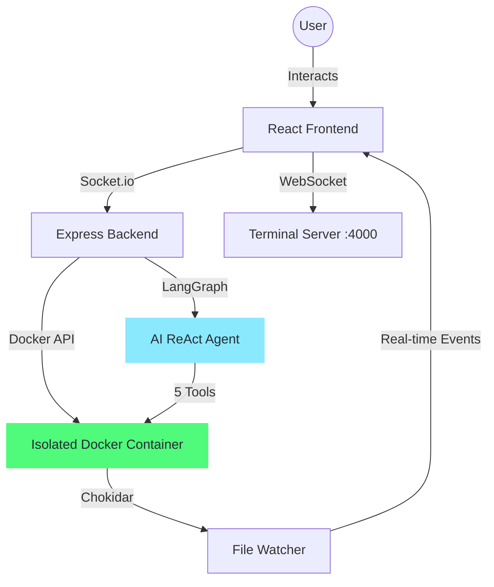

# CogniBox: Agentic AI Code Sandbox 🚀


<p align="center">
  
</p>

<p align="center">
  <strong>[Video](https://drive.google.com/file/d/1VJ1gtbHOnevFvb5i0opMtdd1cuunSyFj/view?usp=sharing)</strong>
</p>

<p align="center">
  <strong>An autonomous, browser-based development environment where an AI agent writes, tests, and deploys code for you — inside a fully isolated Docker sandbox.</strong>
</p>

<p align="center">
  <em>Built for the Veersa Hackathon 2027 — ABES Batch of 2027</em>
</p>

---

## 📋 Table of Contents

- [Overview](#overview)
- [Agentic AI Architecture](#-agentic-ai-architecture)
- [System Design](#-system-design)
- [Tech Stack](#-tech-stack)
- [Getting Started](#-getting-started)
- [Docker Setup](#-docker-setup)
- [Running Tests](#-running-tests)
- [API Documentation](#-api-documentation)
- [Project Structure](#-project-structure)
- [Security](#-security)
- [Documentation](#-documentation)
- [Team](#-team)
- [Demo](#-demo)

---

## Overview

CogniBox isn't just another code editor — it's a **collaborative AI engineering system**. You describe what you want to build, and the AI agent autonomously:

1. **Observes** the existing project structure
2. **Plans** a multi-step approach
3. **Executes** by writing real files and running real commands
4. **Iterates** based on tool results until the goal is complete

All of this happens inside an isolated Docker container, with the agent's entire reasoning process streamed live to your browser.

<p align="center">
  
</p>

---

## 🧠 Agentic AI Architecture

> **This is not a chatbot wrapper.** CogniBox implements a true ReAct (Reasoning + Acting) agent.

At the core of CogniBox is a **ReAct Agent** powered by **LangGraph** and **Groq** (Qwen 32B).

### How the Agent Works



### Agent Tools

| Tool | Purpose | Security |
|------|---------|----------|
| `listFiles` | Explore project structure | Scoped to sandbox root |
| `readFile` | Read existing code before modifying | Scoped to sandbox root |
| `writeFile` | Create/modify files | Path traversal blocked |
| `deleteFile` | Remove files/directories | Path traversal blocked |
| `runCommand` | Execute shell commands (npm, git, etc.) | Isolated Docker container |

### Inspectable Prompts

The agent's behavior is controlled by an **external configuration file**:

```
backend/src/config/agent_prompts.json
```

This file is:
- **Inspectable**: Open it to see exactly how the agent behaves
- **Modifiable at Runtime**: Use the API (`GET/PUT /api/v1/agent/prompts`) to view and update prompts
- **Versioned**: Tracked in git for full history

> 📖 For deep technical details, see [Agent Architecture Documentation](docs/AGENT_ARCHITECTURE.md)

---

## 🏗️ System Design

CogniBox is built with a modular, microservices-inspired architecture:



<p align="center">
  
</p>

### Key Design Decisions

1. **Docker Isolation**: Every sandbox runs in its own container — no code execution on the host
2. **Real-time Streaming**: Agent thoughts, tool calls, and results stream via Socket.io — full transparency
3. **Separation of Concerns**: Agent logic, project management, and container orchestration are cleanly separated
4. **External Prompt Config**: Agent prompts are in JSON, not hardcoded — reviewers can inspect and modify

---

## 🛠️ Tech Stack

| Layer | Technology |
|-------|-----------|
| **Frontend** | React 19, Vite, Zustand, TanStack Query, Monaco Editor, XTerm.js, Ant Design |
| **Backend** | Node.js, Express 5, Socket.io, Dockerode, Chokidar |
| **AI Agent** | LangGraph, LangChain, Groq (Qwen 32B) |
| **Infrastructure** | Docker, docker-compose |
| **Testing** | Vitest, Supertest |

---

## 🚀 Getting Started

### Prerequisites

- **Docker** installed and running
- **Node.js** 18+ 
- **Groq API Key** — [Get one free](https://console.groq.com)

### Manual Setup

1. **Clone the repository**
   ```bash
   git clone https://github.com/SriShruti24/Code-Sandbox-Clone.git
   cd Code-Sandbox-Clone
   ```

2. **Build the sandbox Docker image**
   ```bash
   cd backend
   docker build -t sandbox -f Dockerfile.sandbox .
   ```

3. **Configure environment variables**
   ```bash
   # Backend
   cp backend/.env.example backend/.env
   # Edit backend/.env and add your GROQ_API_KEY
   
   # Frontend
   cp frontend/.env.example frontend/.env
   ```

4. **Install dependencies & run**
   ```bash
   # Terminal 1 — Backend
   cd backend && npm install && npm run dev
   
   # Terminal 2 — Frontend
   cd frontend && npm install && npm run dev
   ```

5. **Open** `http://localhost:5173` in your browser

---

## 🐳 Docker Setup

For a one-command setup using Docker Compose:

```bash
# Set your Groq API key
export GROQ_API_KEY=your_key_here

# Start everything
docker-compose up --build
```

This will build and start:
- **Backend** on port 3000 (API + Socket.io)
- **Terminal Server** on port 4000 (WebSocket)
- **Frontend** on port 5173
- **Sandbox base image** (for container spawning)

---

## 🧪 Running Tests

CogniBox uses **two types of testing** to ensure reliability:

### Unit Tests (Agent Tool Validation)
```bash
cd backend && npm test
```

Tests include:
- Path traversal prevention
- File read/write operations
- Prompt configuration validation

### API Integration Tests
```bash
cd backend && npm test
```

Tests include:
- Endpoint request validation (missing fields → 400)
- Response shape contracts
- Agent logs retrieval
- Health check endpoint

### Test Output
```bash
# Run all tests with verbose output
cd backend && npx vitest run --reporter=verbose
```

---

## 📡 API Documentation

Full API documentation is available at **[docs/API.md](docs/API.md)**.

### Quick Reference

| Method | Endpoint | Description |
|--------|---------|-------------|
| `GET` | `/ping` | Health check |
| `POST` | `/api/v1/projects` | Create new sandbox project |
| `GET` | `/api/v1/projects/:id` | Get project details + file tree |
| `POST` | `/api/v1/agent` | Start AI agent on a goal |
| `GET` | `/api/v1/agent/:id/logs` | Get agent execution history |
| `GET` | `/api/v1/agent/prompts` | Inspect agent prompts |
| `PUT` | `/api/v1/agent/prompts` | Update agent prompts at runtime |

### Real-time Events (Socket.io)

| Event | Direction | Description |
|-------|-----------|-------------|
| `agent:log` | Server → Client | Streamed agent reasoning & tool calls |
| `fileChanged` | Server → Client | File system change notifications |

---

## 📁 Project Structure

```
Code-Sandbox-Clone/
├── backend/
│   ├── src/
│   │   ├── config/
│   │   │   ├── agent_prompts.json    # ← Inspectable AI agent prompts
│   │   │   └── serverConfig.js
│   │   ├── controllers/
│   │   │   ├── agentController.js    # Agent endpoint + log persistence
│   │   │   └── projectController.js  # Project CRUD
│   │   ├── service/
│   │   │   ├── langgraphAgent.js     # ← Core ReAct agent + 5 tools
│   │   │   └── projectService.js     # Project lifecycle
│   │   ├── containers/               # Docker container management
│   │   ├── socketHandlers/           # Socket.io event handlers
│   │   ├── routes/                   # Express route definitions
│   │   ├── tests/
│   │   │   ├── agentTools.test.js    # Unit tests
│   │   │   └── api.test.js           # API integration tests
│   │   ├── utils/
│   │   ├── index.js                  # Main server entry
│   │   └── terminalApp.js            # WebSocket terminal server
│   ├── Dockerfile.sandbox            # Sandbox container image
│   └── package.json
├── frontend/
│   ├── src/
│   │   ├── components/
│   │   │   ├── atoms/
│   │   │   ├── molecules/
│   │   │   │   ├── EditorComponent/  # Monaco code editor
│   │   │   │   ├── BrowserTerminal/  # XTerm.js terminal
│   │   │   │   ├── TreeNode/         # File tree nodes
│   │   │   │   └── ContextMenu/      # Right-click menus
│   │   │   └── organisms/
│   │   │       ├── AgentPanel/       # ← AI agent UI (goal input + log stream)
│   │   │       ├── Browser/          # Live preview iframe
│   │   │       └── TreeStructure/    # File explorer
│   │   ├── pages/
│   │   │   ├── CreateProject.jsx     # Home / project creation
│   │   │   └── ProjectPlayground.jsx # Main IDE workspace
│   │   ├── stores/                   # Zustand state management
│   │   ├── hooks/
│   │   ├── apis/
│   │   └── config/
│   └── package.json
├── docs/
│   ├── API.md                        # Full API documentation
│   ├── AGENT_ARCHITECTURE.md         # Agentic AI deep-dive
│   └── DESIGN.md                     # UI/UX design documentation
├── docker-compose.yml                # One-command full stack setup
├── .gitignore
└── README.md                         # ← You are here
```

---

## 🔐 Security

| Measure | Implementation |
|---------|---------------|
| **Container Isolation** | All code execution confined to Docker containers |
| **Non-root Execution** | Sandbox containers run as `sandbox` user |
| **Path Traversal Prevention** | Agent tools validate and normalize all file paths |
| **Secret Management** | API keys in `.env` files, never committed to git |
| **Input Validation** | Request body validation on all API endpoints |
| **Execution Timeout** | Agent commands timeout after 60 seconds |

---

## 📚 Documentation

| Document | Description |
|----------|-------------|
| [API Documentation](docs/API.md) | All REST endpoints, Socket.io events, WebSocket protocol |
| [Agent Architecture](docs/AGENT_ARCHITECTURE.md) | ReAct loop, tool architecture, prompt design, streaming pipeline |
| [UI/UX Design](docs/DESIGN.md) | Information architecture, component hierarchy, design system |

---

## 👥 Team

> **Team Name**: SheCodes Trinity

| Name | Role |
|------|------|
| Shruti Srivastava | Full-Stack + AI Agent | 
| Varnika Chaudhary | Testing   | 
| Drishti Dubey |Frontend  | 

---

## 🎬 Demo

- **Demo Video**: [Video](https://drive.google.com/file/d/1VJ1gtbHOnevFvb5i0opMtdd1cuunSyFj/view?usp=sharing)


---
