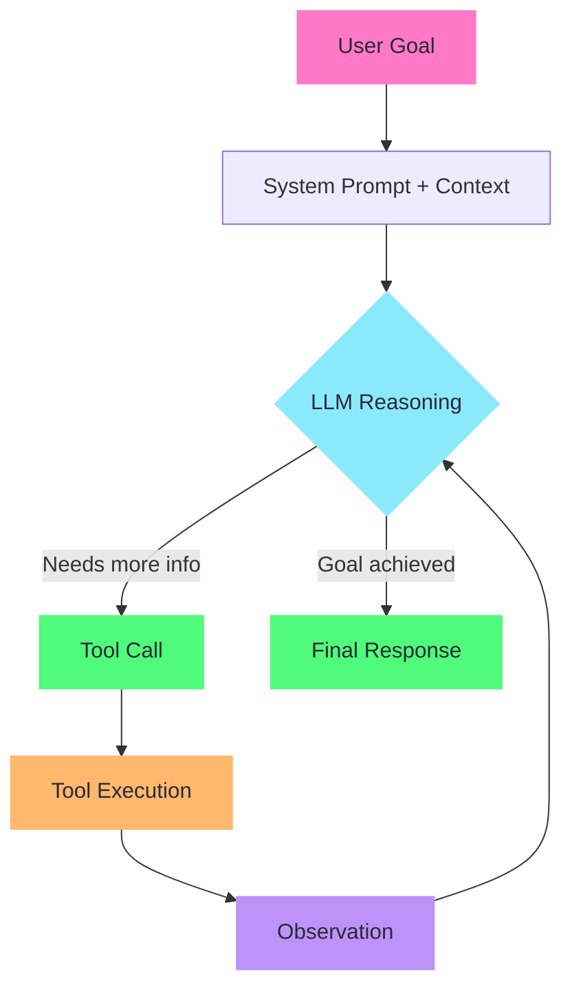
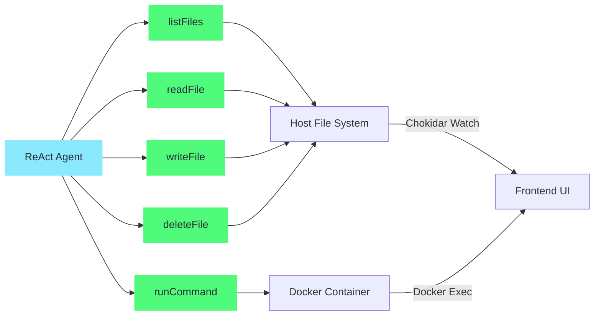
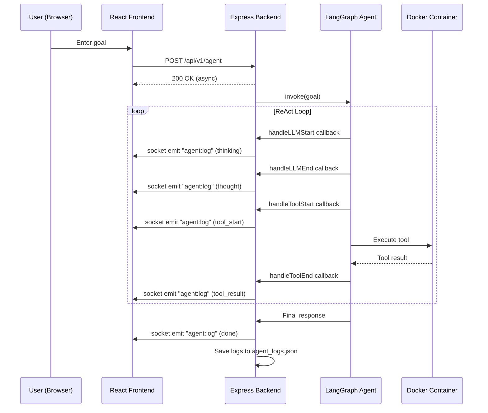
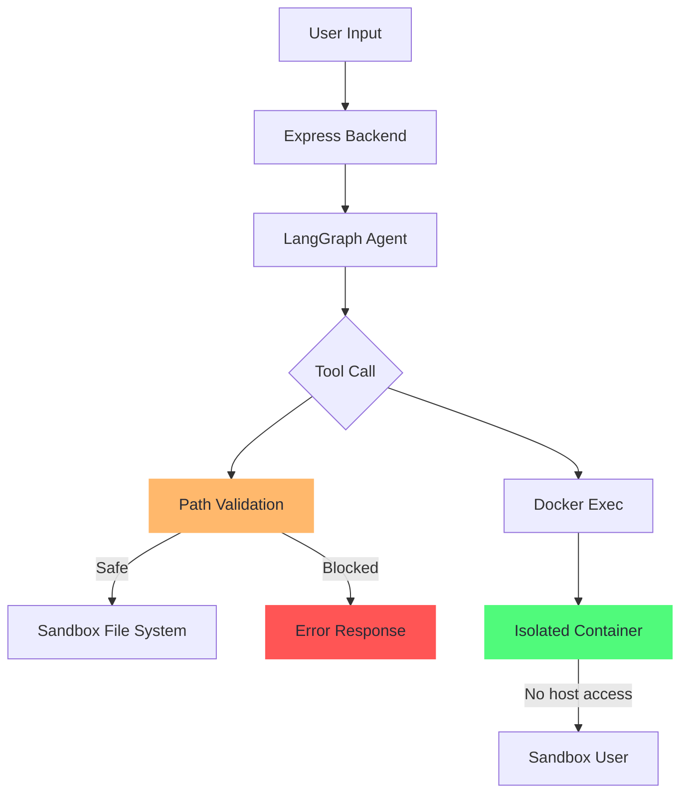

# CogniBox — Agentic AI Architecture

## Overview

CogniBox implements a **ReAct (Reasoning + Acting) Agent** using [LangGraph](https://github.com/langchain-ai/langgraphjs) and [Groq](https://groq.com/) (Qwen 32B). The agent operates autonomously inside a sandboxed Docker environment, demonstrating the three pillars of agentic AI: **Reasoning**, **Planning**, and **Execution**.

This is not a simple chatbot wrapper — the agent observes the environment, plans multi-step actions, uses real tools, and iterates until the goal is achieved.

---

## Agent Loop — ReAct Architecture



### How the Loop Works

1. **Goal Injection**: The user provides a natural language goal (e.g., "Create a todo app with local storage").
2. **Reasoning**: The LLM receives the system prompt + goal + previous observations and decides the next action.
3. **Tool Selection**: Based on reasoning, the agent selects one of 5 tools (listFiles, readFile, writeFile, deleteFile, runCommand).
4. **Execution**: The tool executes in the real sandbox environment (file system or Docker container).
5. **Observation**: The tool result is fed back to the LLM as context.
6. **Iteration**: Steps 2-5 repeat until the agent determines the goal is complete.
7. **Completion**: The agent emits a final summary of what it accomplished.

---

## Tool Architecture



### Tool Details

| Tool | Purpose | Security |
|------|---------|----------|
| **listFiles** | Explore project structure before making changes | Scoped to sandbox root |
| **readFile** | Understand existing code before modifying | Scoped to sandbox root |
| **writeFile** | Create or modify files with full content | Path traversal blocked |
| **deleteFile** | Remove files or directories | Path traversal blocked |
| **runCommand** | Execute shell commands (npm, node, etc.) | Runs inside isolated Docker container |

---

## Prompt Architecture

The agent's behavior is controlled by a **system prompt** stored in an external configuration file:

```
backend/src/config/agent_prompts.json
```

This file is **not hardcoded** inside the agent logic. It is loaded at runtime, making it:
- **Inspectable**: Reviewers can read the prompt to understand agent behavior.
- **Modifiable**: The prompt can be updated via the API (`PUT /api/v1/agent/prompts`) or by editing the JSON file directly.
- **Versioned**: Changes to the prompt are tracked in git.

### Prompt Design Principles

The system prompt encodes:
1. **Environment awareness**: The agent knows it's working inside a Vite + React sandbox.
2. **Behavioral rules**: 14 critical rules that prevent dangerous actions (e.g., no `cd`, no modifying `node_modules`, relative paths only).
3. **Workflow pattern**: Always `read → plan → write → verify`.
4. **Safety constraints**: Path traversal prevention, no dev server management.

---

## Real-Time Streaming Architecture



### Why This Matters

Unlike traditional AI chatbots that return a single response, CogniBox **streams every step** of the agent's reasoning process:

- **Thinking**: When the LLM starts processing
- **Thought**: The actual reasoning output (chain-of-thought visible to user)
- **Tool Start**: Which tool was selected and with what parameters
- **Tool Result**: What the tool returned from the real environment
- **Done/Error**: Final outcome

This transparency allows users to:
- Understand *why* the agent made certain decisions
- Debug issues in the agent's reasoning
- Build trust through observable behavior

---

## Security Model



| Layer | Protection |
|-------|-----------|
| **File System** | All paths normalized and checked against sandbox root; `..` traversal blocked |
| **Docker** | Commands execute as non-root `sandbox` user inside isolated container |
| **Network** | Container has limited network access |
| **Secrets** | API keys stored in `.env` files, never in code or git |
| **Timeouts** | Commands timeout after 60 seconds to prevent infinite loops |

---

## Example Agent Execution

**Goal**: "Create a counter component with increment and decrement buttons"

| Step | Action | Detail |
|------|--------|--------|
| 1 | `listFiles(".")` | Understand project structure |
| 2 | `listFiles("src")` | Check existing source files |
| 3 | `readFile("src/App.jsx")` | Read current App component |
| 4 | **Reasoning** | Plan: Create Counter.jsx in src/components/, update App.jsx to import it |
| 5 | `writeFile("src/components/Counter.jsx", ...)` | Create the Counter component with state management |
| 6 | `readFile("src/App.jsx")` | Re-read App.jsx before modifying |
| 7 | `writeFile("src/App.jsx", ...)` | Update App to import and render Counter |
| 8 | **Done** | "I've created a Counter component with increment and decrement buttons..." |

The Vite dev server (running in the Docker container) automatically picks up file changes, and the user sees the result in the embedded browser — all without manual intervention.
