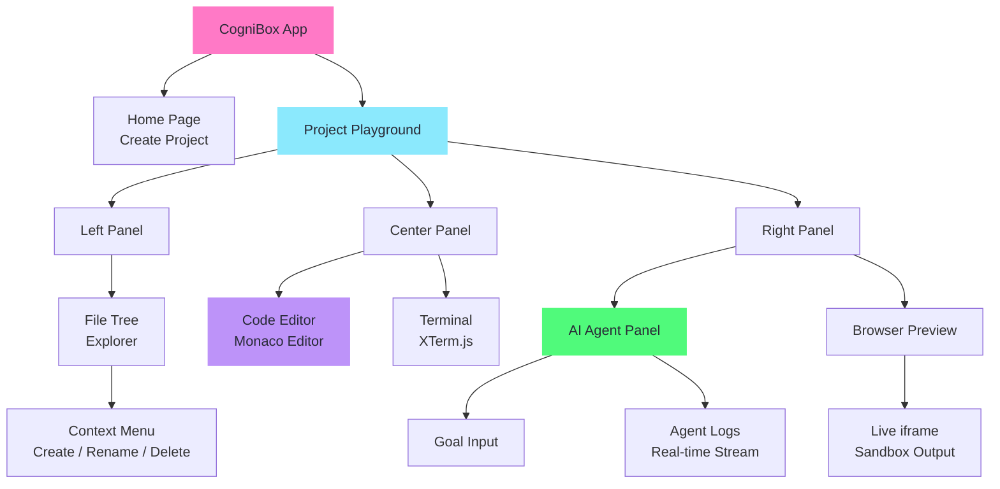
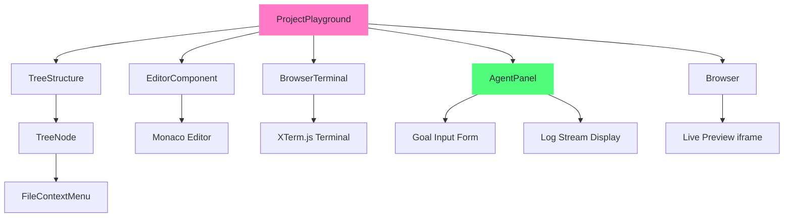
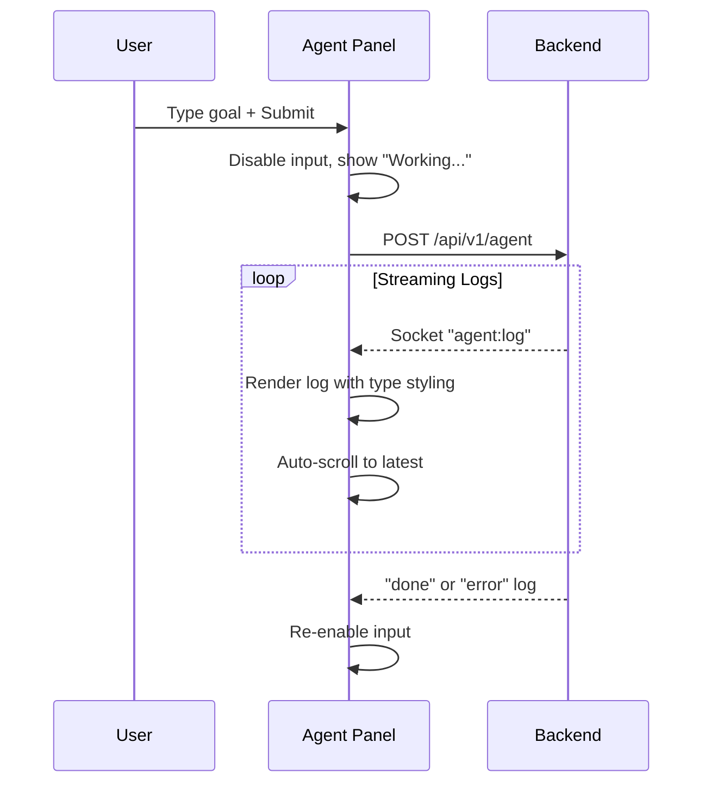

# CogniBox — UI/UX Design Documentation

## Design Philosophy

CogniBox's interface is designed to feel like a **professional IDE** while making AI-powered development transparent and accessible. The design draws inspiration from VS Code and modern developer tools, using a Dracula-inspired dark theme that reduces eye strain during extended use.

---

## Information Architecture



---

## Page Structure

### 1. Home Page — Project Creation

**Purpose**: Entry point where users create new sandbox projects.

**Layout**:
- Hero section with CogniBox branding
- Project creation form
- Existing project list with clickable cards

**Key Interactions**:
- Click "Create Project" → API call → Redirect to Playground
- Click existing project card → Navigate to its Playground

---

### 2. Project Playground — Main IDE

**Purpose**: The core workspace where users code, interact with the AI agent, and preview output.

**Layout**: Three-panel split layout using [Allotment](https://github.com/johnwalley/allotment) for resizable panels.

```
┌──────────┬────────────────────┬──────────────────┐
│          │                    │                  │
│  File    │   Code Editor      │  AI Agent Panel  │
│  Tree    │   (Monaco)         │  ── or ──        │
│          │                    │  Browser Preview │
│          ├────────────────────│                  │
│          │   Terminal          │                  │
│          │   (XTerm.js)       │                  │
└──────────┴────────────────────┴──────────────────┘
```

**Resizable**: All panel boundaries are draggable via Allotment splitters.

---

## Component Architecture



### Component Design Pattern

CogniBox uses **Atomic Design** methodology:

| Level | Components | Purpose |
|-------|-----------|---------|
| **Atoms** | Basic UI primitives | Smallest building blocks |
| **Molecules** | EditorComponent, BrowserTerminal, TreeNode, ContextMenu | Functional UI units |
| **Organisms** | TreeStructure, AgentPanel, Browser | Complex, self-contained sections |
| **Pages** | CreateProject, ProjectPlayground | Full page layouts |

---

## Design System

### Color Palette (Dracula-Inspired)

| Token | Hex | Usage |
|-------|-----|-------|
| Background | `#282a36` | Main editor background |
| Current Line | `#44475a` | Active elements, borders |
| Foreground | `#f8f8f2` | Primary text |
| Comment | `#6272a4` | Secondary text, placeholders |
| Cyan | `#8be9fd` | Thinking states, highlights |
| Green | `#50fa7b` | Success, tool actions, active states |
| Orange | `#ffb86c` | Status indicators, warnings |
| Pink | `#ff79c6` | Accents, branding |
| Purple | `#bd93f9` | Tool results, code highlights |
| Red | `#ff5555` | Errors, destructive actions |
| Yellow | `#f1fa8c` | Warnings, attention |

### Typography

| Context | Font | Size |
|---------|------|------|
| Code / Terminal / Agent | `'Fira Code', 'Consolas', monospace` | 13-14px |
| UI Labels | System font stack | 13-14px |
| Headers | System font stack | 16-18px |

### Spacing & Layout

- Panel padding: `12-16px`
- Component gap: `8px`
- Border radius: `6-8px`
- Border color: `#44475a`

---

## AI Agent Panel — UX Design

The Agent Panel is the core differentiator of CogniBox. Its design prioritizes **transparency**:

### Log Type Visual Language

Each agent log type has a unique **color + icon** combination for instant recognition:

| Type | Icon | Color | Purpose |
|------|------|-------|---------|
| Thinking | ⏳ Clock | Cyan | Agent is processing |
| Thought | 📊 Activity | White | Agent's reasoning visible |
| Tool Start | 🔧 Wrench | Green | Tool invocation |
| Tool Result | 📄 File | Purple | Tool output |
| Status | ⚡ Bolt | Orange | Lifecycle events |
| Done | ✅ Check | Green | Completion |
| Error | ❌ Cross | Red | Failure |

### Interaction Flow



---

## Responsive Design

CogniBox is designed for **desktop-first** usage (developers use large screens), but the Allotment-based layout ensures panels can be resized to any proportion. Key responsive behaviors:

- File tree collapses to minimum 250px width
- Agent panel and browser share the right panel via tabs
- Terminal and editor split vertically with adjustable ratio
- Context menus position dynamically to avoid overflow

---

## Accessibility Considerations

- High contrast Dracula palette exceeds WCAG AA contrast ratios
- All interactive elements have hover/focus states
- Terminal and editor support keyboard navigation
- Agent logs use semantic HTML structure for screen readers
